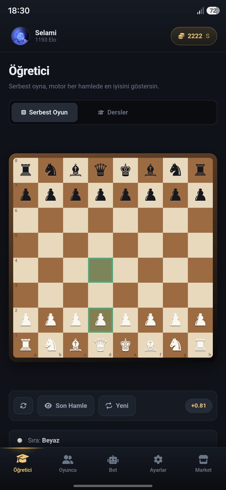

# Şahname — Chess Trainer

**English** | [Türkçe](README.tr.md)

<p align="center"></p>

A fully offline mobile chess app for learning and playing chess. It is built with
web technologies and packaged for Android with Capacitor. The user interface is in
Turkish.

## Features

- **Learn** — interactive lessons that show how each piece moves on the board
- **Play the bot** — games against the in-browser Stockfish engine with adjustable
  difficulty, plus an analysis helper that explains moves in Turkish
- **Two players** — **serverless** games between two phones on the same Wi-Fi: the
  WebRTC connection is established by scanning QR codes (the SDP is compressed with
  gzip + base64url so that it fits into a QR code)
- **Shop** — board and piece themes, rarity tiers, an in-game coin economy
- **Profile and rating** — player profile, match history, rating system
- **Promo codes** — signed with HMAC-SHA256, optionally bound to a single device
- **Feedback form**, haptics, sound effects, light/dark theme
- All data is stored on the device; no internet connection is required

## Tech Stack

HTML · CSS · JavaScript · Capacitor 6 · Stockfish (WebAssembly) · chess.js ·
WebRTC · jsQR / qrcodejs · AdMob

## Project Structure

```
index.html, style.css      User interface
app.js                     App logic (profile, shop, lessons, economy, routing)
game.js                    Game board and match flow
engine.js                  Communication with Stockfish
p2p.js                     Device-to-device connection via WebRTC + QR
native.js                  Capacitor plugins (haptics, status bar, storage)
server.js                  Development server for testing on the local network
build.js                   Collects the files to be packaged into www/
vendor/                    Bundled libraries (for offline use)
android/                   Capacitor Android project
```

## Development

```bash
npm install
npm run sunucu        # http://localhost:5173 — also reachable from devices on the same Wi-Fi
```

## Android Build

Requires JDK 17 and the Android SDK.

```bash
npm run senkron       # node build.js + npx cap sync android
cd android
gradlew assembleDebug
```

See [YAYIN.md](YAYIN.md) for the Play Store release steps (in Turkish).

## Configuration

The following values are intentionally not included in the repository for security
reasons; fill them in with your own values in `app.js`:

| Constant | Description |
|---|---|
| `Promosyon.GIZLI` | Secret key used to sign promo codes |
| `GeriBildirim.ANAHTAR` | [Web3Forms](https://web3forms.com) access key |
| `GeriBildirim.MAIL` | Fallback e-mail address if the form cannot be sent |

The release signing files (`*.jks`, `keystore.properties`) are also excluded via
`.gitignore`.

## License

This project is licensed under the **GNU GPL v3**, because it bundles a JavaScript
build ([stockfish.js](https://github.com/niklasf/stockfish.js)) of the GPLv3-licensed
[Stockfish](https://github.com/official-stockfish/Stockfish) engine.
